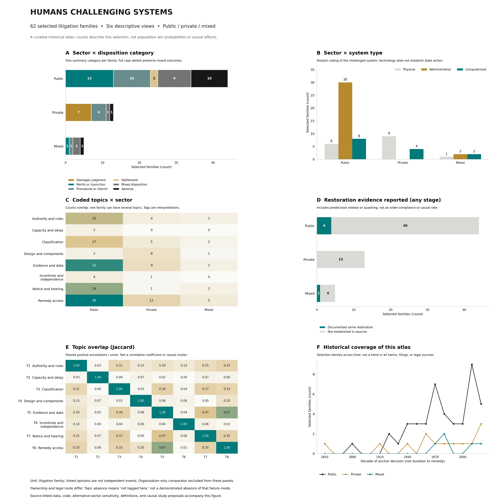
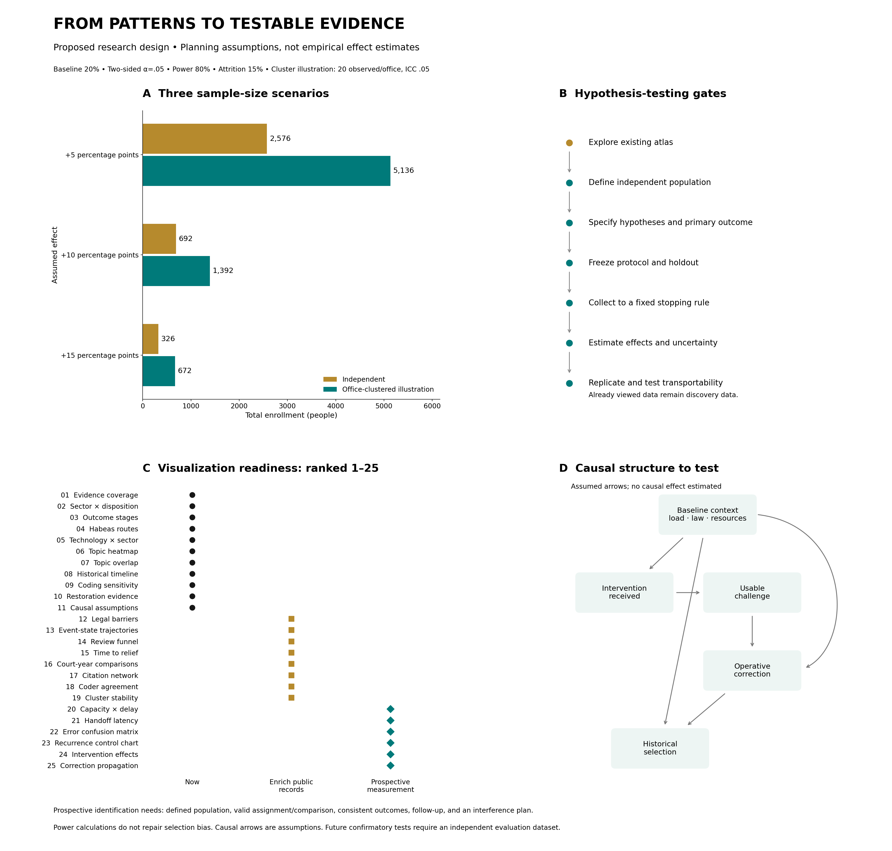

# Human Remedy Observatory

### From recognizing an error to verifying its correction.

A public research project of **Kapukai Governance Lab** examining how people challenge consequential decisions made through public institutions, private organizations, and automated systems.

The central question is:

**When a system makes a harmful error, can the affected person identify it, obtain meaningful review, secure a remedy, and verify that the correction actually happened?**

## What we study

- Habeas corpus and the factual foundations of custody.
- False or unreliable evidence, mistaken identity, and classification errors.
- Human, administrative, algorithmic, and physical system failures.
- Public, private, and mixed responsibility.
- Barriers to review and remedies.
- The difference between a favorable decision and completed correction.

## Initial research collection

The initial release contains:

- **62 selected human-centered litigation families**, plus one separately identified organization comparator.
- **19 identified habeas proceedings** within that collection.
- Source-linked case tables and classification notes.
- Interactive dashboards and reproducible analysis scripts.
- A research plan ranking **25 visualization approaches**.
- A reproducible acquisition workflow for **29,270 Supreme Court Database records**.

The larger corpus is a separate research resource. It is not a representative sample of all habeas petitions or all harmful system failures.

## Browse the research

- [Case catalogue](methods/CASE_CATALOGUE.md) — all source-linked litigation families and interpretation limits.
- [Habeas case table](methods/HABEAS_CASES.md) — verified habeas proceedings and separately marked non-habeas comparisons.
- [Case data: CSV](data/curated/cases.csv) · [JSON](data/curated/cases.json) · [Codebook](methods/CODEBOOK.md).
- [Analysis plan](methods/ANALYSIS_PLAN.md) — 25 ranked visualizations, proposed hypotheses, power calculations, and causal limits.
- [Supreme Court Database coverage](SCDB_DATA.md) — frozen source versions, aggregate findings, and reproducible downloads.
- [Reproduction guide](RESEARCH_GUIDE.md) — commands, files, classifications, and licensing.
- [Publication and legal scope](methods/PUBLICATION_AND_LEGAL_SCOPE.md).

### Dashboards and figures

The **local research workbench** combines the case atlas, relationship views, larger-corpus coverage, and research-to-legislation plan. It runs with Python 3 and a browser; no package installation, account, or API key is required. Its charts have no external library or network dependencies.

From a downloaded or cloned repository, run:

```bash
python3 scripts/check_data.py
python3 scripts/serve_workbench.py
```

The browser opens at `http://127.0.0.1:8765/`. Keep the terminal running; press Control-C to stop. GitHub's file viewer displays source code and does not run the app. The default view includes **57 US families**; select all jurisdictions to view all **62 human-centered families**. The organization comparator is separately optional.

- [Terminal workflow](docs/TERMINAL_WORKFLOW.md) — first setup, updates, troubleshooting, and a safe status report to share.
- [Critical path and work packages](docs/CRITICAL_PATH.md) — M0–M6 with explicit acceptance gates.
- [25-view dashboard registry](data/research/dashboard-registry.json) — 10 exploratory views, one design-only view, and 14 requiring further measurements. Four additional plots describe the separate SCDB corpus.
- [Legislative tests and discussion draft](docs/LEGISLATIVE_TESTS.md) — proposed, untested controls with sources, metrics, and safeguards.
- [Evidence-event schema](schemas/research-events.schema.json) · [Blank event template](templates/evidence-event.csv) · [Unregistered hypothesis template](templates/hypothesis-plan.json).

The workbench is a local research snapshot, not a live court feed. Filters and exports preserve the selected denominator. Missing event histories, independent coding, operational measurements, and evaluation cohorts are explicit research dependencies.

The original standalone [case-patterns.html](dashboard/case-patterns.html) and [research-design.html](dashboard/research-design.html) remain available. Those older exports require internet access for their pinned D3 chart library.






## How to interpret the evidence

We distinguish:

1. What a party alleged.
2. What a court found or held.
3. What relief the court allowed or ordered.
4. What practical correction is documented.
5. What remains unknown.
6. What researchers infer from the record.

A hearing is not a release. A judgment is not proof of payment. Missing follow-up is not proof that a remedy failed.

## Research standards

Exploration is valid and necessary. Hypotheses developed through exploration must be identified as exploratory.

Confirmatory studies should specify their hypotheses, outcomes, comparisons, exclusions, analysis methods, and stopping rules before examining independent evaluation data.

We do not treat:

- Selected-case counts as population success rates.
- Correlation as causation.
- Similarity clusters as proof of shared causes.
- Statistical significance as proof of practical importance.
- A public or private label as a complete legal determination of responsibility.

## Sources and reproducibility

Case records retain source links and interpretation limits. Analyses document their units, inclusion rules, assumptions, and data versions.

Third-party data retain their applicable rights. Where redistribution permission has not been established, the project provides source links and reproducible download instructions rather than republishing raw files.

## Corrections and contributions

Contributions should identify the case, disputed statement or field, supporting primary source, proposed correction, and relevant later proceedings.

Substantive corrections should be documented and reflected in affected tables and charts.

Do not submit sealed records, private family dossiers, credentials, personal identifiers, or identifying information that a court has withheld.

## Scope

This repository supports public research, systems engineering, and legislative development. It does not provide individualized legal advice, guarantee a remedy, certify a system as safe, or make its contents automatically admissible in court.

**Truth as a public utility.**
