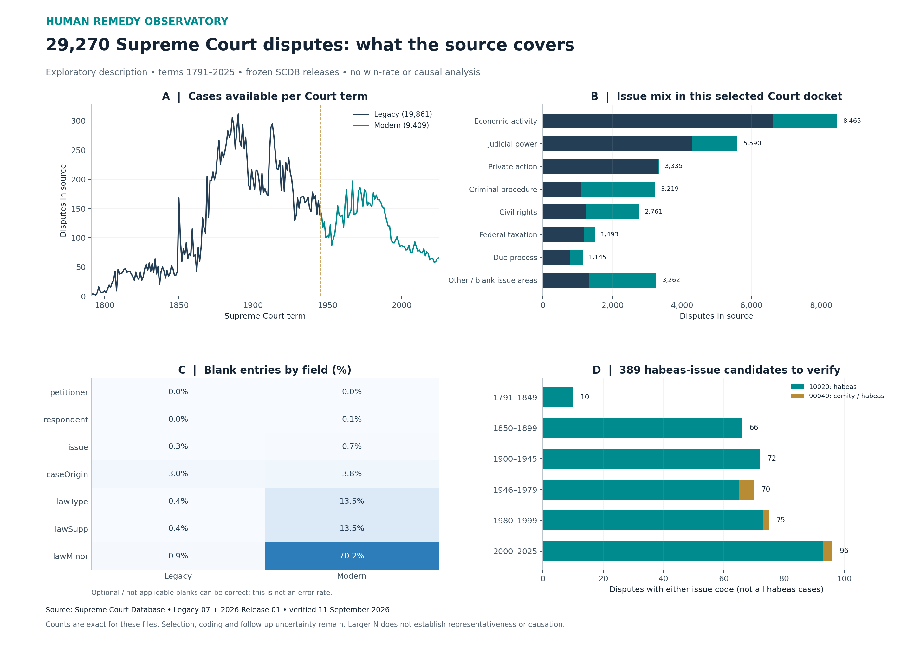

# Supreme Court source coverage: descriptive baseline

**This is exploratory descriptive analysis (EDA), not a hypothesis test.** It measures what the acquired source contains. It does not measure which system failures caused harm or whether public systems lose more often than private systems.



## Frozen input

| Release | Court terms | Unique disputes |
|---|---|---:|
| SCDB Legacy 07 | 1791–1945 | 19,861 |
| SCDB 2026 Release 01 | 1946–2025 | 9,409 |
| Combined | 1791–2025 | **29,270** |

Each CSV has 53 fields. The downloaded case-centered citation variant includes a consolidated dispute once. The combined files contain no duplicated or empty `caseId` values. The 2025 Court term can include decisions issued in 2026. [Modern release](https://scdb.la.psu.edu/data/2026-release-01/), [legacy release](https://scdb.la.psu.edu/data/scdb-legacy-07/).

## What the four panels show

1. **Coverage by term:** source observations, with the legacy/modern seam marked. Counts reflect Court docket and jurisdiction changes as well as source coverage; they are not system-failure incidence.
2. **Issue mix:** counts in the seven largest source issue areas plus all remaining and blank issue areas. The areas are source categories, not classifications of public or private ownership. [Issue-area definitions](https://scdb.la.psu.edu/online-codebook/issue-area/).
3. **Blank fields:** literal blank entries, divided by the applicable release's row count. Optional or inapplicable fields can correctly be blank. Conversely, a filled field is not verified truth. This is neither an error-rate nor accuracy chart.
4. **Habeas candidates:** **379** disputes coded `issue=10020` and **10** coded `issue=90040`, for **389 candidates** needing opinion verification. These issue labels do not identify every case procedurally arising on habeas. The six historical bins are descriptive and have different durations. [Issue definitions](https://scdb.la.psu.edu/online-codebook/issue/).

The underlying aggregate CSVs and `summary.json` accompany the PNG, SVG and PDF. No `partyWinning`, disposition or other outcome field is analyzed. In SCDB, `partyWinning` concerns the Supreme Court petitioning party, potentially the government, and can include partial relief. It must not become an automatic prisoner-win label. [Winning-party definition](https://scdb.la.psu.edu/online-codebook/winning-party/).

## Reproduce

From the repository root, use Python 3:

```sh
python scripts/download_scdb.py --manifest data/sources/scdb-source-manifest.json
python scripts/scdb_descriptive.py --raw data/raw/scdb
```

Downloading and CSV aggregation use the standard library. Plot generation additionally requires `numpy` and `matplotlib`; `--no-plots` produces only aggregates. The manifest records source URLs, versions and SHA-256 hashes. A changed source fails validation rather than being silently substituted.

## Uncertainty, rights and limits

Counts are exact for the frozen files, so no sampling confidence interval is attached. Selection uncertainty, source coding limitations, omitted cases and unknown remedy implementation remain. **A large dataset cannot establish causation or representativeness by itself.** This Court's cases are not the denominator for all habeas filings, all injured people, or all public/private system failures.

Public downloads and citation instructions are available, but an explicit wholesale redistribution license was not established in the checked source pages. Raw third-party CSV/ZIP files and the codebook are therefore excluded from this repository; the downloader retrieves them directly from the publisher. This repository's license does not relicense those inputs. [SCDB citation instructions](https://scdb.la.psu.edu/how-to-cite-us/).

The Federal Judicial Center IDB is a stronger candidate for a federal district-court habeas filing frame. Its guide has been reviewed, but it has not been ingested here. Nature-of-suit coding, repeat records, procedural outcomes and remedy implementation require separate validation. [FJC research guide](https://www.fjc.gov/sites/default/files/IDB-Research-Guide.pdf).

Data retrieved and descriptively summarized on 11 September 2026. See the project analysis plan for the distinction between exploratory work and future confirmatory tests.
